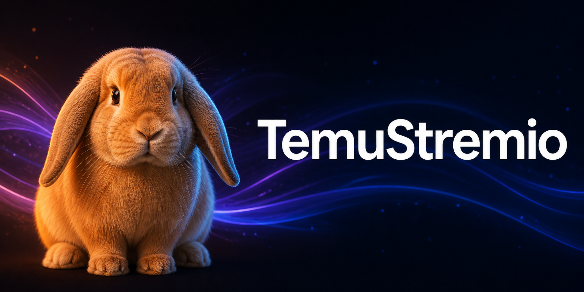

# TemuStremio

TemuStremio is an independent SwiftUI client for the public Stremio add-on
protocol. It brings catalogs, search, details, episode browsing, add-on stream
selection, a local library, and playback progress to iPhone, iPad, Apple TV,
and Apple Watch.

The Apple Watch app stands on its own. It talks to add-ons directly, can sign
in and sync an account's library and installed add-ons, keeps watch-local
playback progress, and plays HTTPS or HLS sources supported by AVPlayer. A
streaming server you configure can resolve torrents or convert incompatible
HTTP(S) video to HLS. It does not need the iPhone app and does not include
Watch Together.

TemuStremio is unofficial and is not affiliated with or endorsed by Stremio or
Temu. It does not provide media, paid-service access, or a DRM bypass. Use only
add-ons and streams you are legally allowed to access.

## What is here

| Platform | Main experience |
| --- | --- |
| iOS and iPadOS 16+ | Catalogs, account and add-on sync, profiles, library, resume state, several playback engines, and optional Watch Together rooms |
| tvOS 18+ | A remote-first television interface with shelves, search, details, episodes, profiles, stream failover, and native transport controls |
| watchOS 10+ | A standalone, watch-sized catalog, account/add-on sync, search, details, streams, library, progress, settings, manual URL entry, and native or server-assisted HLS playback |

The iOS player can route media through the custom Bunny player, KSPlayer, or
MobileVLCKit. Apple-native HLS uses AVFoundation where appropriate. Torrent and
magnet sources need a compatible streaming server; no torrent engine is
embedded in the app.

There is no advertising, analytics SDK, or first-party tracking. The default
build also leaves the optional Watch Together backend endpoints empty. Read
[PRIVACY.md](PRIVACY.md) before connecting an account, add-on, streaming
server, or self-hosted backend.

## Build it

You need a Mac with Xcode, XcodeGen 2.42 or newer, Rust, and FFmpeg. The
simulator and device scripts download the checksum-pinned MobileVLCKit build on
first use.

```sh
git clone https://github.com/danialbka/temustream.git
cd temustream/minimal-app
brew install xcodegen rust ffmpeg
./scripts/test.sh
./scripts/build-simulator.sh
open StremioSkeleton.xcodeproj
```

`project.yml` is the source of truth for the generated Xcode project. Run
`xcodegen generate --spec project.yml` after changing targets or build
settings.

For a local sideloading handoff IPA:

```sh
cd minimal-app
SKELETON_PUBLIC_RELEASE=1 ./scripts/build-device.sh
```

That produces `minimal-app/build/StremioSkeleton-device.ipa`. It has no Apple
distribution identity or provisioning profile and must be signed for your own
device before installation. Public-release mode performs a clean app build and
keeps the optional Watch Together endpoints empty even when this Mac has a
local development configuration. TestFlight, App Store, and registered-device
exports use a different signing flow. The complete checklist is in
[docs/RELEASING.md](docs/RELEASING.md).

If Xcode stalls while reading an iCloud or File Provider checkout, use the
repository's verified local-scratch path instead:

```sh
SKELETON_PUBLIC_RELEASE=1 ./scripts/dev-workflow.sh build-device
```

## Configure the app

The default catalog works without a local backend. Add other manifest URLs from
the Add-ons screen. Remote account, manifest, and API traffic must use HTTPS.
Plain HTTP is limited to loopback and private-network streaming servers.

If a selected add-on returns a torrent or magnet source, configure a compatible
streaming server in Settings. Treat stream URLs as secrets when they contain
temporary tokens or account identifiers.

Watch Together is an optional iOS feature backed by Convex and LiveKit. Its
local configuration files are ignored by Git, and its server credentials must
stay in the provider environment. Setup details remain in
[minimal-app/README.md](minimal-app/README.md). The sample backend is intended
for development and needs rate limits, retention controls, monitoring, and an
abuse policy before a public deployment.

## Verify a change

Start with the focused checks, then use the full gate before a release:

```sh
./scripts/public-release-check.sh
./minimal-app/scripts/test.sh
SKELETON_PUBLIC_RELEASE=1 ./minimal-app/scripts/verify.sh
```

The full gate builds the simulator and device handoff packages and runs the
catalog, playback, E2E, and UI-state checks. A successful build is not proof of
an App Store upload or a physical-device playback pass; those are separate
release checks.

## Repository map

- `minimal-app/` contains the iOS, tvOS, and watchOS apps, shared Swift code,
  Rust playback policy, tests, and build scripts.
- `minimal-app/Backend/watch-together/` contains the optional Convex and
  LiveKit development backend.
- `enhancer/` is the older, separate Stremio IPA enhancer kept for historical
  compatibility. Its install guide is [INSTALL.md](INSTALL.md).
- `docs/` contains release guidance and generated-art provenance.

## Contributing and security

Please read [CONTRIBUTING.md](CONTRIBUTING.md) before opening a pull request.
Report suspected vulnerabilities through the private route described in
[SECURITY.md](SECURITY.md), never in a public issue with credentials or private
stream URLs attached.

Original code in this repository is licensed under the [MIT License](LICENSE).
Player and networking dependencies keep their own licenses. In particular,
KSPlayer and the selected FFmpegKit package are GPL-3.0, which affects binary
distribution. Review [THIRD_PARTY_NOTICES.md](THIRD_PARTY_NOTICES.md) before
shipping an IPA. This repository is not legal advice.

The banner, app icon, and profile artwork were created for this project. Their
generation briefs and checksums are recorded in
[docs/ASSET_PROVENANCE.md](docs/ASSET_PROVENANCE.md).
