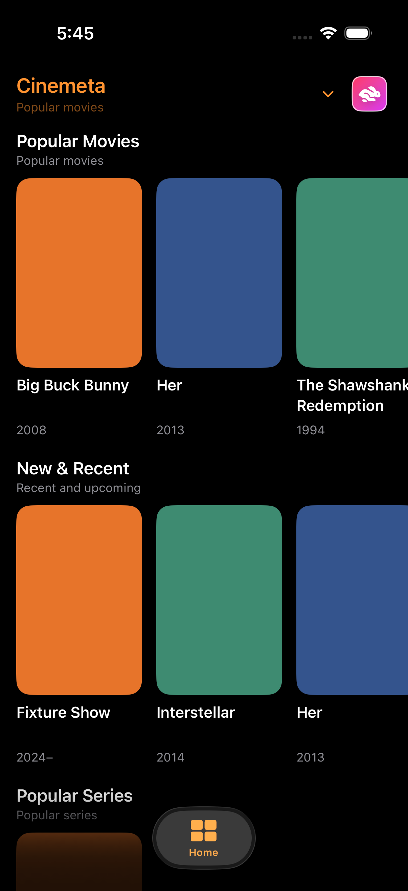
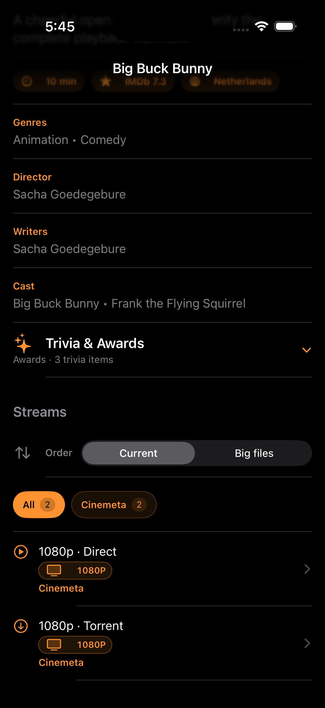
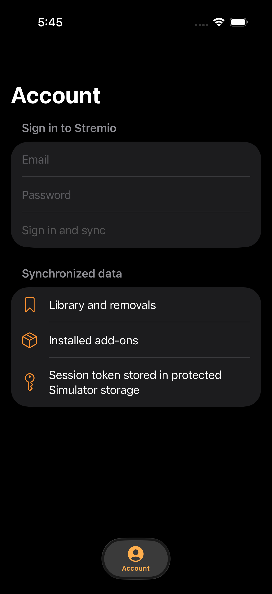

# Bunny

Bunny is an unofficial SwiftUI client for Stremio accounts and add-ons. It uses
its own app identity, so it can sit beside another Stremio client on the same
device.

Bunny includes catalogs, search, library sync, profiles, stream selection, and
its own media player. It does not provide media or paid-service access. Use only
add-ons and streams you are allowed to access.

<p align="center">
  
  
  
</p>

## Connect your Stremio account

1. Open Bunny and tap **More**, then **Account**.
2. Enter the email and password for your existing Stremio account.
3. Tap **Sign in and sync**. Wait for the status to say **Synced now**.
4. Use **Sync now** after changing your library or add-ons on another device.

Your library, removals, and installed add-ons are synchronized. On iPhone and
iPad, the session token is kept in Keychain. Bunny does not save your password.

If an add-on does not appear, open **Add-ons**, paste its complete HTTPS
`manifest.json` URL, and tap **Validate and install**.

## Build and install

You need a Mac with Xcode, XcodeGen 2.42 or newer, and Rust 1.95.0.

```sh
git clone https://github.com/danialbka/temustream.git
cd temustream/minimal-app
brew install xcodegen rust
./scripts/test.sh
SKELETON_PUBLIC_RELEASE=1 ./scripts/dev-workflow.sh build-bunny-device
```

The IPA is written to
`/private/tmp/stremio-dev-workflow/workspace/build/Bunny-device.ipa`. It has an
ad hoc signature, so open it in Sideloadly and sign it with your own Apple ID
before installing it on an iPhone or iPad.

For App Store or TestFlight packaging, see [the release guide](docs/RELEASING.md).
Player details and supported containers are in
[the media-core notes](minimal-app/docs/RUST_MEDIA_CORE.md).

## License and credits

Bunny is open source under the [MIT License](LICENSE).

Bunny is an independent client built to work with Stremio accounts and add-ons.
Thank you to the Stremio maintainers and contributors for the ecosystem that
made this kind of client possible. No Stremio source code is included in Bunny.

See the [third-party notices](THIRD_PARTY_NOTICES.md) for Stremio project
credits, the Rust standard library license, and the optional backend licenses.
Bunny is not affiliated with or endorsed by Stremio.
